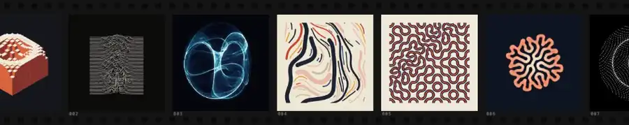

<p align="center"><a href="https://jamiew.github.io/p5js-render/"></a></p>

# p5js-render

Render p5.js sketches to MP4, WebM or GIF in headless Chromium. Every frame is drawn once, in order, on a virtual clock with a seeded random generator, so the same sketch always makes the same video.

**[Demo site: gallery, debug views, how it works and FAQ](https://jamiew.github.io/p5js-render/)**

## Quick start

You need Node.js 22.18 or newer, pnpm and ffmpeg on your `PATH`.

```bash
pnpm install
pnpm exec playwright install chromium

pnpm render cube-wave                 # writes output/cube-wave.mp4
pnpm render cube-wave --debug         # same, with the debug HUD burned in
pnpm render ./my-sketch.js -o loop.gif --duration 3
pnpm render:all --duration 6          # every sketch in examples/
```

For seamless loops, animate from `window.p5Render.progress`, which runs from 0 up to 1 across the video.

## CLI

`pnpm render <sketch> [options]` takes an example name, a path to a `.js` file or an `http(s)` URL. Use `--code "<p5 code>"` for inline sketches and `--all` for every example.

| Option                                    | What it does                                                                          |
| ----------------------------------------- | ------------------------------------------------------------------------------------- |
| `-o, --output <file>`                     | Output path. The extension picks the format: `.mp4` (H.264), `.webm` (VP9) or `.gif`. |
| `--out-dir <dir>`                         | Where default outputs go. Default `output`.                                           |
| `--frames <dir>`                          | Also save every frame as an image.                                                    |
| `-f, --fps <n>`                           | Frames per second. Default 30.                                                        |
| `-d, --duration <sec>`                    | Length in seconds. Default 4.                                                         |
| `-s, --seed <n>`                          | Seed for `random()` and `noise()`. Default 1.                                         |
| `-w, --width`, `--height`                 | Canvas size when the sketch has no literal `createCanvas(w, h)`. Default 800x600.     |
| `--debug`                                 | Burn in a HUD with frame number, time, draw cost and seed.                            |
| `--crf <n>`                               | Video quality, lower is better. Defaults: 18 for MP4, 30 for WebM.                    |
| `--pixel-density <n>`                     | p5 pixel density. Default 1, so output size equals canvas size.                       |
| `--format png\|jpeg`, `--quality <0-100>` | Image format for captured frames.                                                     |
| `--capture canvas\|screenshot`            | `screenshot` captures the whole page, for sketches that draw with DOM elements.       |
| `--timeout <ms>`                          | How long `setup()` may take. Default 30000.                                           |
| `--p5-version`, `--p5-url`, `--p5-path`   | Load a different p5 build, for example `--p5-version 1.11.13` for older sketches.     |

## Gallery

Rendered by this tool from [`examples/`](examples). Click one to read its source.

<table>
  <tr>
    <td align="center"><a href="examples/cube-wave.js"></a><br><b>Cube Wave</b><br><sub>after Bees &amp; Bombs</sub></td>
    <td align="center"><a href="examples/pulsar-ridges.js"></a><br><b>Pulsar Ridges</b><br><sub>after Unknown Pleasures</sub></td>
    <td align="center"><a href="examples/clifford-bloom.js"></a><br><b>Clifford Bloom</b><br><sub>strange attractor density map</sub></td>
  </tr>
  <tr>
    <td align="center"><a href="examples/flow-fibers.js"></a><br><b>Flow Fibers</b><br><sub>after Tyler Hobbs</sub></td>
    <td align="center"><a href="examples/truchet-weave.js"></a><br><b>Truchet Weave</b><br><sub>Truchet tiles, Vera Molnar palette</sub></td>
    <td align="center"><a href="examples/reaction-diffusion.js"></a><br><b>Reaction Diffusion</b><br><sub>Gray-Scott Turing patterns</sub></td>
  </tr>
  <tr>
    <td align="center"><a href="examples/dot-lattice.js"></a><br><b>Dot Lattice</b><br><sub>after Etienne Jacob</sub></td>
    <td align="center"><a href="examples/schotter-drift.js"></a><br><b>Schotter Drift</b><br><sub>after Georg Nees, 1968</sub></td>
    <td align="center"><a href="examples/moire-orbit.js"></a><br><b>Moire Orbit</b><br><sub>after Bridget Riley</sub></td>
  </tr>
</table>

## License

MIT
